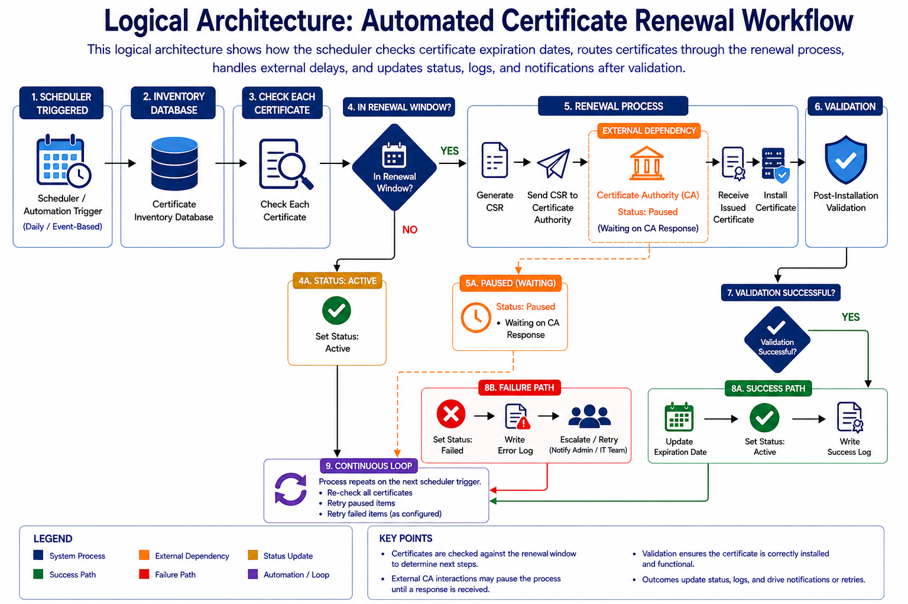

# ReCert

**Automated Certificate Lifecycle Management System**

ReCert is a full-stack system designed to automate the monitoring, renewal, and management of digital certificates. It simulates real-world certificate workflows by integrating scheduling, renewal logic, external certificate authority interactions, and post-installation validation.

---

## 🚀 Overview

Managing SSL/TLS certificates manually is error-prone and time-consuming. Missed renewals can lead to service outages and security risks.

ReCert addresses this by automating the entire certificate lifecycle:
- Monitoring expiration dates
- Detecting renewal windows
- Executing renewal workflows
- Handling external dependencies (e.g., Certificate Authorities)
- Validating installations
- Updating system state and logs

---

## ⚙️ Key Features

- **Automated Scheduling**
  - Periodically checks all certificates using a scheduler

- **Renewal Window Detection**
  - Determines when a certificate should enter the renewal process

- **State-Based Workflow**
  - Tracks certificate states such as:
    - Active
    - In Progress
    - Paused (Waiting on CA)
    - Failed

- **CSR Generation & CA Interaction**
  - Simulates CSR creation and submission to a Certificate Authority

- **External Dependency Handling**
  - Supports paused states for real-world delays (e.g., waiting for CA response)

- **Validation & Status Updates**
  - Performs post-installation validation and updates certificate status

- **Logging & Error Handling**
  - Tracks success and failure events for visibility and debugging

---

## 🏗️ System Architecture

ReCert follows a workflow-driven architecture:

1. Scheduler triggers certificate checks  
2. Certificates are evaluated against a renewal window  
3. Certificates in scope enter the renewal pipeline  
4. External CA interaction may pause processing  
5. Certificates are installed and validated  
6. Status is updated based on success or failure  
7. Process repeats in continuous cycles  

---

## 🧠 Technologies Used

### Backend
- Python
- FastAPI

### Frontend
- React

### Concepts & Design
- Event-Driven Architecture  
- Workflow Automation  
- State-Based Systems  
- RESTful APIs  

---

## 👥 Team

- [Tyler Brashears - Project Manager]
- [Brady Moore – Frontend Developer]
- [Kevon Scales – Backend Developer]
- [Nichaela Barella – Automation & Workflow Developer]
- [Abdurrahman Oyediran – Automation & Workflow Developer]

---

## 🧪 Demo

[Demo Video](https://drive.google.com/file/d/1LLIGrgNFgmxvIyOGL9ATGty1YKGYot6-/view?usp=drivesdk)

---

## 📌 Purpose

ReCert was developed to demonstrate how certificate lifecycle management can be automated using modern system design principles. The system models real-world enterprise workflows, including external dependencies and delayed processing.

---

## 🔗 Related

- [Landing Page](https://recertlandingpage.netlify.app)
- [Demo Video](https://drive.google.com/file/d/1LLIGrgNFgmxvIyOGL9ATGty1YKGYot6-/view?usp=drivesdk)

---

## 📄 License

This project is for academic and demonstration purposes.
